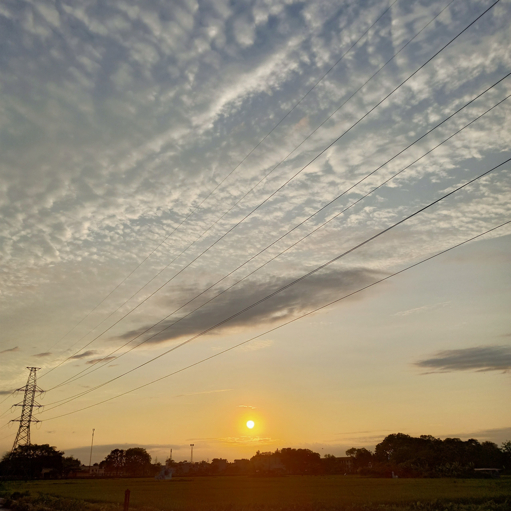

It's May. Summer is coming, with plenty of work ahead for me.

Firstly, I have some projects to finish. One is from my club, which is to make some kinda blog website. One is from my class, in which I have to develop software to illustrate some sorting algorithms. Both are pretty challenging and even though I've been really familiar with such projects, they'll still take me lots of time. 

Secondly, I'm competing in the ***Creative Idea Challenge*** at my university - a contest for students to present their startup ideas. If I can make it through the final round, I can present my idea in front of many people in English at the **B1 lecture hall**. It's going to be a big day, and I really look forward to that, since that hall is incredibly cool, you can see it below:

Lastly, I'm having my mid-term exams at the end of the month,  just in time the above contest is over. This semester I'm studying **13** subjects, which is an insane number (at least to me). But I'm not afraid. I will never give up once I've set the goals for myself, so let's see how far I can go.
 
It's funny how terrible and stress I was last week and now I've managed to get through everything. Today is labour day, and I think I can really sit back, chill out, enjoy the air of my countryside, as I can hardly have the chance to feel it once more the following month. Isn't it peaceful?

*Here.we.go!*

