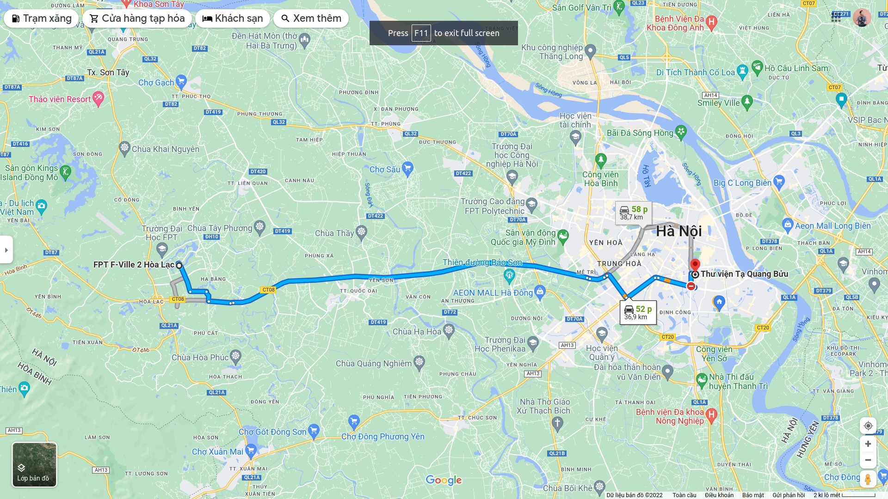
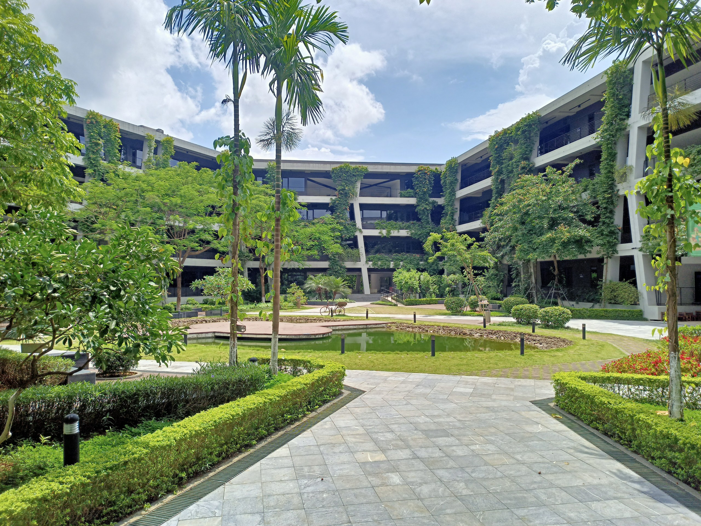
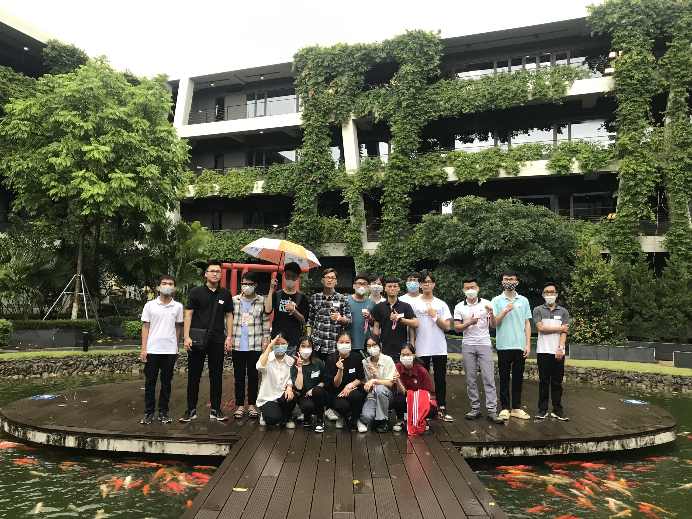
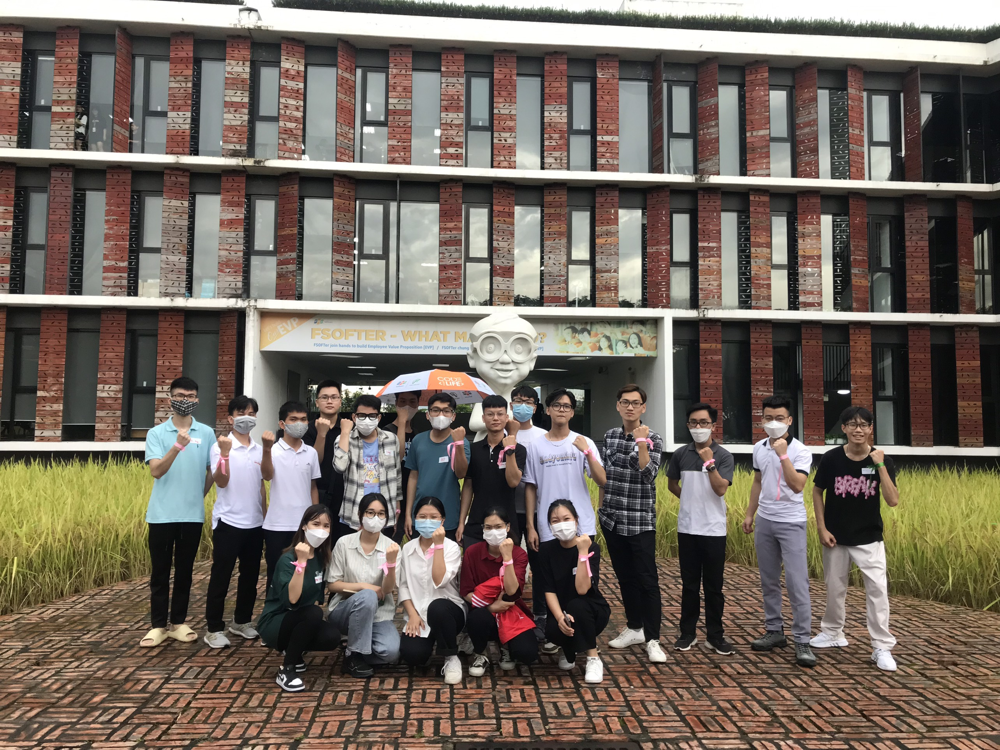
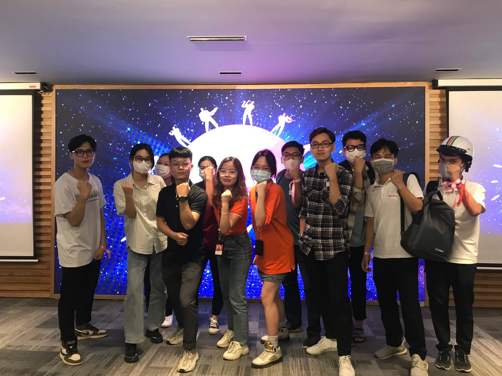

I got a chance to visit Fville - an FPT Software campus - yesterday. It was an amazing trip, with many exciting experiences and provoking thoughts for me. Before talking about what I think, let's revisit the campus with me, shall we?

## My experiences

The journey began at 12:10 pm. We got picked up by a bus at our school library and head our way straight to Hoa Lac Hi-tech Park, which is about 40km far from my university (you can see the direction below). It took us 50 minutes to get there. 

For those of you who don't know, FPT Software is part of the FPT Corporation - one of the largest groups in Vietnam. This trip was held for students in HUST (like me) to see the chance of internships and working at FPT Software. Fville is one of FPT Software's campuses, a space where its employees work together and enjoy all the facilities that suit their needs. 

Ok, back to the story! When we arrived at the Fville, I was stunned by the view of the space. Fville has a modern design and is surrounded by "green" elements - trees, lakes, and grass paths. They even built a dam around the whole site to bring cool air into the buildings.

They give names for each floor and part of each floor following the name of streets in Hanoi. If I remember right, the first floor is called "Future", with Ba Dinh & Hoan Kiem districts (2 districts of Hanoi), and each room will be named after a street or a lake. They have a map that includes everything about the area, but I forgot to take picture of that (my bad). 

We went into a big hall, called "Chu Sau" (Uncle Six?). They welcomed us with a small presentation about FPT, its history, and the corporate culture. After that, we played a small Kahoot about everything we just listened to, but I couldn't win it (I hate Kahoot). Next, they split us into groups to play a small game. The game required each team to solve a passcode. Our team solved the passcode shortly, and we found out our objective was to take a picture at the reception desk - which they use to upload on their FB fan page. 

Now that the game is over, we could finally start to visit the building. Our tour guide was an FPT TA (talent acquisition) and an undergraduate student of FPT University. They were both kind, friendly, and energetic (also pretty :>). We got to see the facilities of Fville: gym, billiard, canteen, pool, working space (looks like they come here just to chill ...). They even have a motel that their employee can hire with a maximum of five people/ room for only 100k VND (which means less than a cup of coffee for each?). 

One thing I like is that they have buses to pick their employees to work and give them catering services, so you don't have to worry about how to get there, or buying food on the way home. It's super convenient!

We then return to the hall ("Chu Sau") to play some team-building games. Our team got 4th out of 6 teams, but that doesn't matter, because we had a wonderful time together. 

## My thoughts
After spending the afternoon there, having the chance to meet new people and see new things, I think I have learned so many things. Despite being a second-year student, I still struggle to find my path for my career, whether to become a developer to work in software or blockchains, or becoming an IoT engineer, or work at low-code positions like BA, QA, QC, DevOps, or maybe even work in HR, I still don't know. But after the trip, I think I got my answer. 

The answer is:

> Just do your thing.

Really, just do your thing. Focus on it and let it guide you. Many of the employees I met yesterday didn't take the job that they learned at the university, but they all seemed happy with their job (at least that's what I thought).

What I mean is, you don't have to worry that much about what to do in the future. If you have something that you've already worked on, keep doing it, and be good at it. That thing will lead you to opportunities that you might never think about. 

Trust me, I'm speaking from my own experience. Last year I held a **TEDx Conference** - many ITers considered that a waste of time - but that experience has taught me so many things, and offer me the chance to work and make connections with people, which brought opportunities for me later on. My tour guide at FPT studied at **FTU** (Foreign Trade University), a university that has nothing to do with technology, but many of her friends are working as Bridge Engineer and DevOps (which required knowledge in IT). And you know what they all have in common?
 
> They ALL didn't know what to do in their junior years, nor intended to do this job.

Some of them got this position because they joined a club at university and worked on events, and one of them happened to be an event held by FPT. They took their chance to get their internship at FPT through that, and found out their exceptional skills would be suitable to be a DevOps. Do you get what I mean? 

The right people will come to you at the right time, just when you're doing things you feel right. Don't compare yourself to others, because you've already known: 

*They're just doing their things.*

