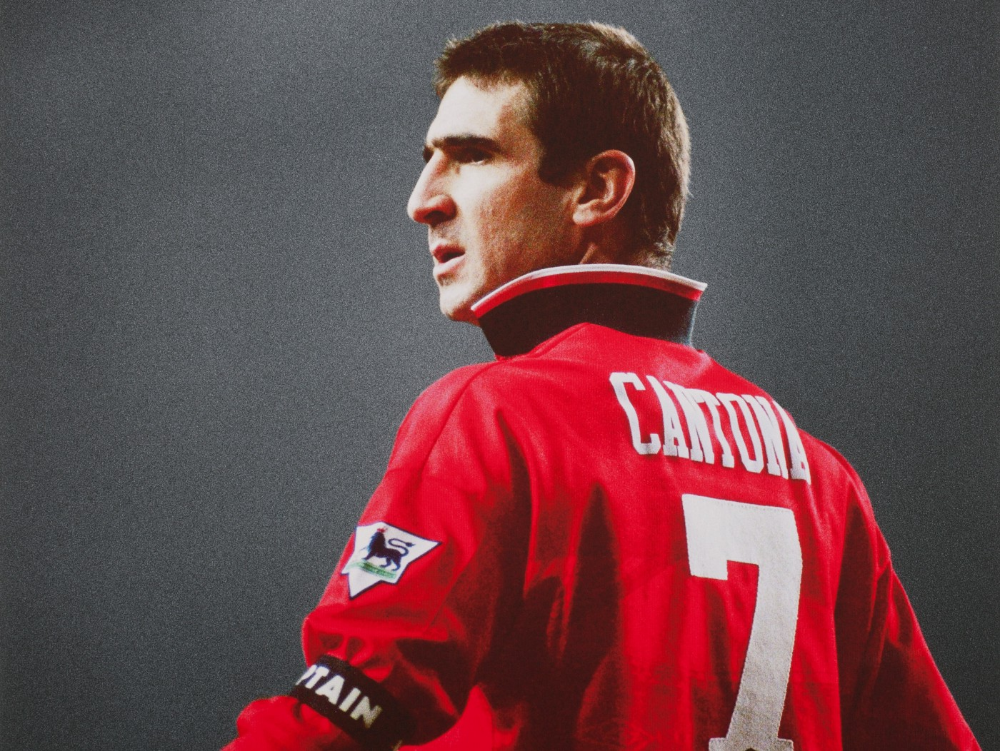
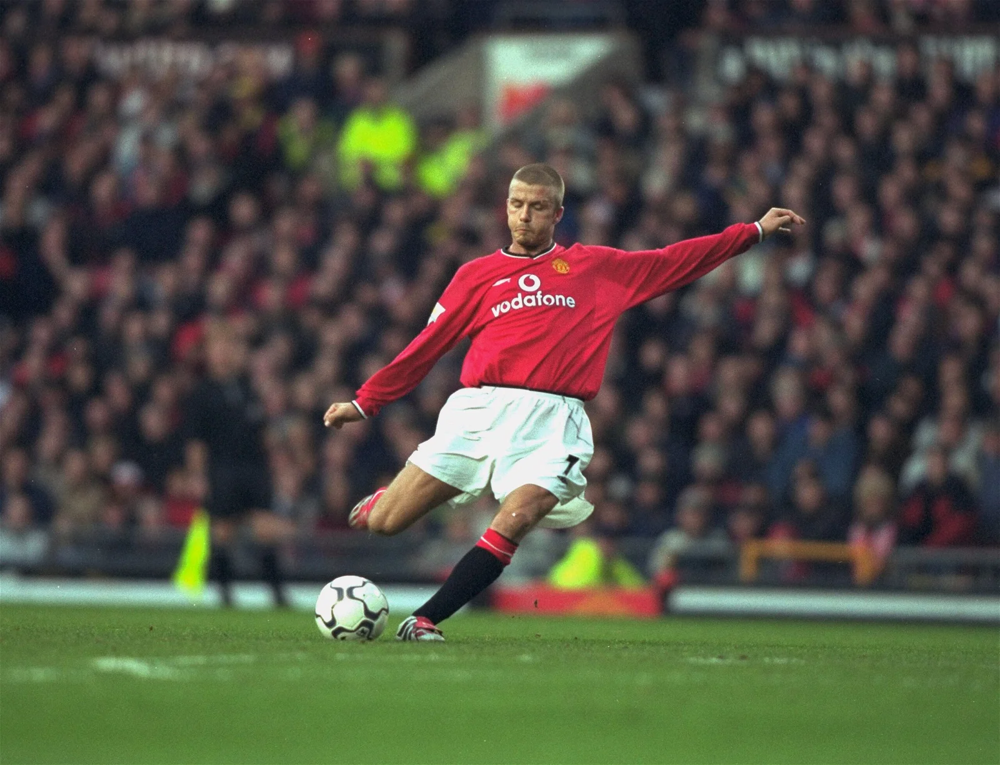
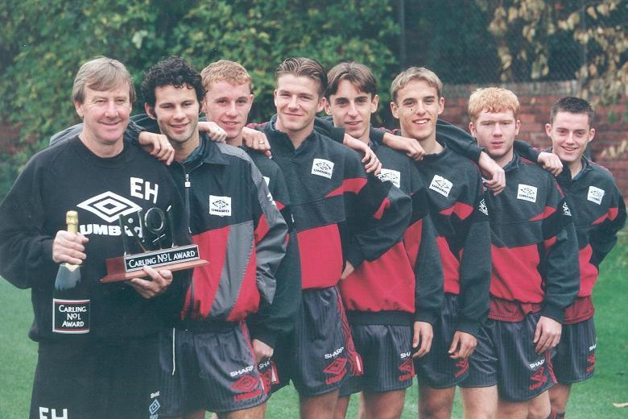
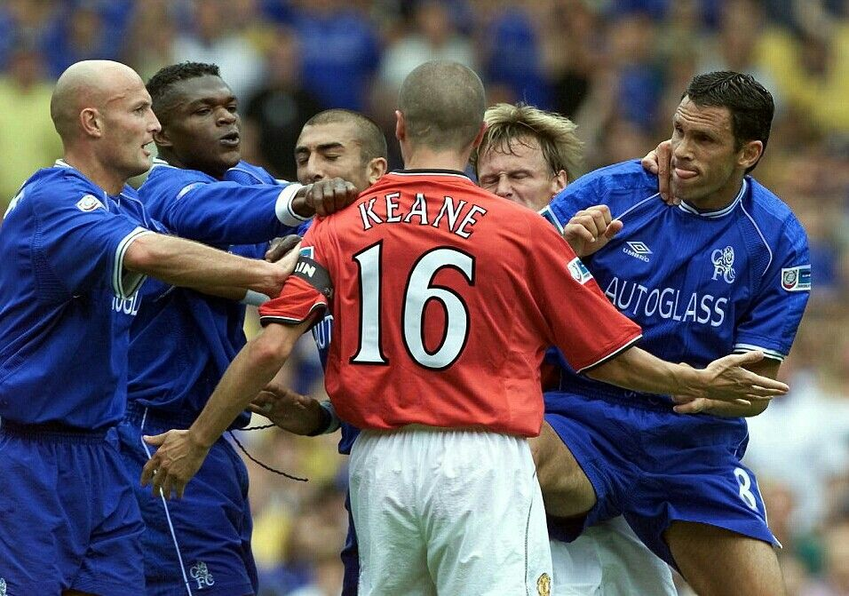
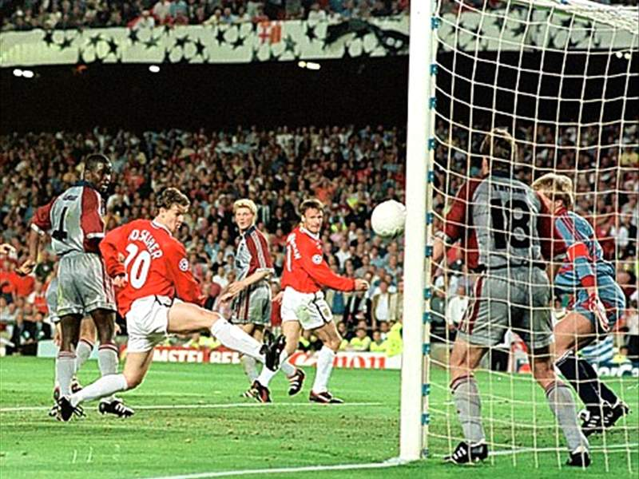
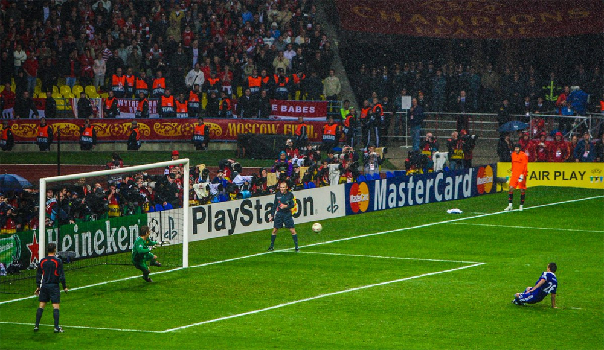

Tiếng còi kết thúc trận đấu vang lên. Tỷ số:
> Manchester United 0 - 4 Brentford

Đối với những ai mới chỉ bắt đầu theo dõi bóng đá vài năm gần đây, kết quả này có lẽ không còn quá xa lạ. Chương trình "Gặp nhau cuối tuần" vẫn diễn ra đều đặn ở "Nhà hát của những giấc mơ", mang tới niềm vui và tiếng cười sảng khoái cho biết bao người trên thế giới.

Tuy vậy, đã từng có một Manchester United rất khác. 

Lịch sử thế giới ít ghi nhận những trường hợp đặc biệt như đội bóng này. Một đội bóng đã trải qua biết bao thăng trầm - từ những buổi đầu thành công cho tới ngày chuyến bay định mệnh cướp đi sinh mệnh của cả một thế hệ cầu thủ vàng của câu lạc bộ ([**Munchen 1958**](https://vi.wikipedia.org/wiki/Th%E1%BA%A3m_h%E1%BB%8Da_h%C3%A0ng_kh%C3%B4ng_M%C3%BCnchen)), để rồi họ hồi sinh mạnh mẽ bằng cách lên đỉnh Châu Âu chỉ vỏn vẹn 10 năm sau đó, với đầu tàu là **Sir Bobby Charlton** - kẻ sống sót vĩ đại trong chuyến bay định mệnh đó. Để rồi chính câu lạc bộ lại trải qua một chu kì đi xuống hơn chục năm, cho tới ngày **Sir Alex Ferguson** tới và chắp bút cho trang sử mới của câu lạc bộ.

Vâng, lịch sử của United mạnh mẽ như vậy đó. Vậy nên bất chấp những năm tháng khó khăn sau khi **Sir Alex Ferguson** rời chiếc ghế thuyền trưởng, mình vẫn tin ngày nào đó họ sẽ trở lại. Dẫu cho nó có hơi mù quáng, nhưng thành thật mà nói, tại sao lại không thể không yêu câu lạc bộ này được chứ?

Với tất cả sự tôn trọng, mình sẽ không thể không nhắc tới **Sir Matt Busby**, cùng bộ ba **Sir Bobby Charlton, Denis Law, George Best** - những người làm nên đế chế Manchester United vào những năm cuối thập niên 60. Tuy vậy, phải tới khi **Alex Ferguson** tới, "Quỷ đỏ" mới thực sự trở thành một biểu tượng toàn cầu, và là hình ảnh đã chiếm trọn trái tim biết bao người hâm mộ năm châu.

Thời gian đầu của **Ferguson** chẳng dễ dàng gì. Đội trải qua bốn năm với vỏn vẹn chiếc cúp FA, thậm chí đã từng xuất hiện một biểu ngữ trên sân vào khoảng thời gian đó như sau:
> "Fergie - 3 năm toàn là phân"

Vạn sự khởi đầu nan mà, phải không? Thật may ngày đó họ đã đặt niềm tin vào ông ấy, bởi nếu không trang sử câu lạc bộ hẳn đã mất đi một chương rất đẹp rồi.

Manchester United của những năm 90 là một đội bóng đẹp. Ở đó có **Eric Cantona**, với chiếc cổ áo luôn để dựng - ngang tàng, ngông nghênh, nhưng thể hiện đúng cái chất của đội bóng, của chính anh khi đó: một ông vua đích thực.

Có **David Beckham**, đẹp trai, với mái tóc lãng tử, đã chinh phục biết bao chị em cũng như cầu môn với cái chân đá phạt vô cùng kì diệu. Có một câu nói cực kì nổi tiếng khẳng định đúng phẩm chất này:

Rồi chúng ta có **Paul Scholes, Ryan Giggs, hai anh em nhà Neville, Nicky Butt**, một thế hệ cầu thủ mà về sau được biết đến dưới cái tên: ***The class of 92***.

Và đừng quên **Roy Keane** - gã điên đích thực trên sân bóng, kẻ sẵn sàng lao vào đạp chết đối phương, chiến đấu tới hơi thở cuối cùng để bảo vệ danh dự cho cái tên Manchester United.

Mình không liệt kê ra những cái tên này chỉ để khoe, bởi câu lạc bộ nào cũng có những huyền thoại. Nhưng điều làm nên Manchester United chính là những câu chuyện của họ - những câu chuyện đầy cảm xúc, thứ mà người ta mong chờ nhất ở một trận đấu.

Quay trở lại với **Cantona**: bạn có biết người được coi là biểu tượng của câu lạc bộ đã từng bay vào đám đông cổ động viên đội bạn để tặng cho tên khốn đó [một cú cước](https://youtu.be/C7PSY7KYThk) vì bị hắn xúc phạm? Mãi về sau này, khi được phỏng vấn về sự cố đó, Cantona vẫn thản nhiên trả lời: "ngày đó nếu chọn lại, đáng ra tôi phải đạp thằng đấy mạnh hơn nữa".

Hay là với **Beckham** - bộ mặt của United, nhưng chính gương mặt điển trai đó từng ăn trọn [cái giày](https://youtu.be/9dCixiClxBI) của **Ferguson** sau một trận đấu tệ hại, bởi khi đó vị cha già cho rằng **Beckham** đã quá mải mê vào những công chuyện của showbiz kể từ ngày quen **Victoria**, để rồi phải cuốn gói rời khỏi United ngay mùa sau đó.

Bạn không thể tìm những mẩu tin như thế ở một câu lạc bộ khác. Và nhắc tới Manchester United thì còn có một điều không thể không đề cập: những cú lội ngược dòng.

Như mình nói ở trên, thể thao là một hình thức giải trí, và mục đích cuối cùng của nó là mang lại cảm xúc, dư vị cho người xem. Nếu bạn là người Việt Nam, chắc chắn bạn đã từng trải nghiệm điều đó vào mùa xuân 2018 cùng U23 Vietnam. Thật tệ khi cứ phải thấp thỏm lo lắng, nhưng rồi được vỡ òa ở những giây phút cuối cùng có tuyệt hơn không? Điều đó giống như về lý chúng ta cần chọn một người ổn định, nhưng không thể không bị cuốn hút bởi những người mang lại cho bản thân nhiều cảm xúc hơn.

Manchester United là như thế. 

Dù cho tỉ số có là đang bị dẫn trước 0-2, 0-3, và trận đấu còn 15 phút. Bạn sẽ bắt đầu thấy **Ferguson** đứng ngoài đường biên, mắt dõi theo, thỉnh thoảng giơ cao đôi tay chỉ vào chiếc đồng hồ, miệng chóp chép miếng kẹo cao su. Trước khi người ta kịp phân tích những cử chỉ đó của **Ferguson**, United đã thắng chung cuộc 3-2. Thậm chí là 4-3.

Họ gọi đó là ***Fergie Time***.

Không có một nghiên cứu nào có thể lí giải hiện tượng kì bí này. Cổ động viên chỉ biết trầm trồ, thán phục, sau mỗi lần "Quỷ đỏ" lội ngược dòng, dẫu cho thời lượng trận đấu chỉ còn được tính bằng giây.

Rốt cuộc họ làm điều đó kiểu gì vậy?

Năm 1999 là năm đầu tiên cúp C1 được phát sóng trên lãnh thổ Việt Nam. Có lẽ những người chú, người bác mình đã từng chọn Manchester United để mến mộ sau [khoảnh khắc này](https://youtu.be/LC_f9CB1Pmg).

Thứ mà Manchester United mang lại đơn thuần là cảm xúc. Nhưng bạn có thể tìm được thứ cảm xúc này nhiều đến vậy ở câu lạc bộ nào trong làng túc cầu ngoài họ chứ? Khoảng thời gian 2000-2010 chứng kiến một Manchester United trình làng một thế hệ mới với những **Ronaldo, Rooney, Ferdinand, Vidic, Van de Sar,...** để rồi họ một lần nữa [lên đỉnh Châu Âu](https://youtu.be/WdBAoWUQDhI) theo cái cách không thể Manchester United hơn - trên chấm Penalty đầy may rủi. Cầu thủ xuất sắc nhất mùa đó, quả bóng vàng thế giới 2008 - **Ronaldo** - là người duy nhất sút trượt bên phía Manchester United (ai mà ngờ tới chứ). Tưởng như mọi chuyện đã kết thúc, nhưng không.

Thực sự thì định mệnh đã chọn Mancheter United vào đêm Moskow huyền ảo. Bạn không tin ư? Vậy giải thích cho mình việc tại sao trong cú đá quyết định, người đội trưởng của Chelsea phải trượt chân, và bóng phải đi trúng cột dọc?

Manchester United là như thế, luôn chiến thắng theo cách cảm xúc nhất có thể.

Những hồi ức về đội bóng, dẫu cho là khoảnh khắc vinh quang hay nỗi buồn khi thất bại, mình sẽ chẳng thể nào quên, dù cho phần lớn lịch sử đó mình đã không được trực tiếp dõi theo. Đó thực sự là những trang sử có thể khiến cho người ta phải nổi da gà mỗi khi nghĩ về. Đó cũng là lí do mà mình yêu đội bóng này, bởi kể cả khi không chiến thắng, họ cũng thất bại đầy cảm xúc. Một đội bóng vĩ đại, cùng những cái tôi vĩ đại, đầy cá tính, làm sao có thể không yêu?

Có lẽ để tổng kết lại về Manchester United trong một bức hình, đối với mình chính là khoảnh khắc [này](https://youtu.be/JpyJtjLoDKg) (bấm vào hình để gif chạy nhé!).

Bạn thấy chứ? Ngang tàng, đầy khí phách, dẫu đang thắng hay thua, **Cantona** và Manchester United luôn ngẩng cao đầu, với chiếc cổ áo dựng lên khinh đời - một vị vua đích thực. **Cantona** vẫn sẽ mãi là **Cantona**, bởi đó là con quỷ đỏ mang trong mình tinh thần United đích thực.

Chỉ tiếc có lẽ, từ sau khi **Ferguson** nghỉ hưu, tinh thần đó đã theo ông rời khỏi sân **Old Trafford** rồi.
