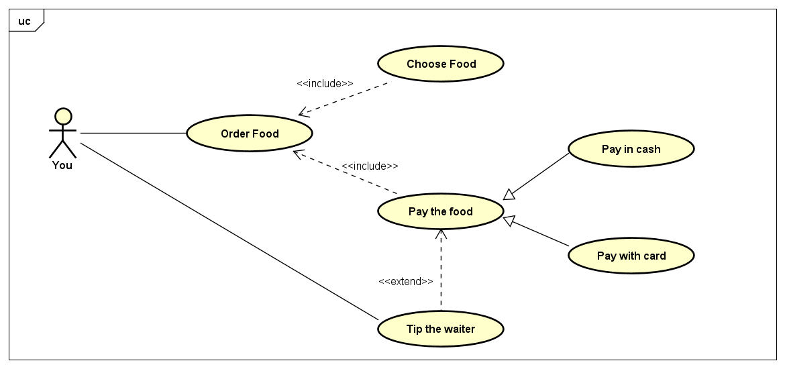

In this tutorial, I want to talk about *Use case Diagram*, one of the basic knowledge you need to know when studying Object-oriented Programming (OOP). For the illustrations in this tutorial, I'm using *Astah UML*, a design tool that supports UML. You can download it [here](https://astah.net/downloads/), and learn how to use it with this [documentation](https://astah.net/support/astah-pro/user-guide/usecase-diagram/).

## What is a use case diagram?

In Object-oriented paradigm, when it comes to designing the system, we often demonstrate that by the Unified Modeling Language (UML). A use case diagram can be used to summarize the details of your system's users and their interaction with the system. 

> So what exactly is the user's interaction with the system?

Good question. Supposed that you're building an application, let's say an online Bookstore. In this case, **interactions** are the things users can do with your application, such as:

* Viewing books
* Buying books
* Adding books to cart

You can add as many interactions as you can think of, but you got the point. And we can demonstrate the user's interaction through the *Use case Diagram*.

Now let's learn how to draw it!

## Use case diagram components

There are 5 main components you'll be working with in a use case diagram:
* Actor
* Use Case
* Association
* System Boundary Box
* Relationships

### Actor

An actor is a user that interacts with the system. It can be a person, an organization, or even a server/ system.

In order to identify the actor, you need to answer this very basic question:

> *"Who will **interact** with the application?"*

Let's say you need to build an e-commerce website. So who will be the actor here?
* User
* Admin

Pretty simple, right?

In a use case diagram, an actor is normally drawn as a stickman, but it can also be drawn as in the picture below: 

Of course, you can draw the actor at your will, as long as there's a detailed name with it.

### Use case, Association & Boundary 

These definitions are pretty straightforward, so I'll just give you the concept and their symbols in the use case diagram:

* **Use cases**: Horizontally shaped ovals that represent the different uses that a user might have.
* **Association**: A line between actors and use cases. In complex diagrams, it is important to know which actors are associated with which use cases.
* **System boundary boxes**: A box that sets a system scope to use cases. All use cases outside the box would be considered outside the scope of that system. For example: In a bank, a client can only view their transactions, not all the transactions in the system, since that *use case* is out of their scope.

Generally, it's easy to work with the above components, since they're not hard to understand. The thing that might actually confuse you is **Relationships**.

### Relationships

There are 3 types of relationships:
* Complicated
* ... Wait, wrong topic

There are 3 types of relationships, again: 
* Include
* Extend
* Generalization

#### Include

Include is like a must-have relationship between use cases.

Think about include this way: suppose you're hungry and want to get something to eat. You walk into MacDonald's and say: "I want to order food!". But what do you have to do first before that?

**You have to choose what to eat first!**

And you can draw it in your use case diagram like this:

 

So to order food, you need to choose what to buy, pretty reasonable, right? That is the *include* relationship. Only when you finish choosing can you proceed to the payment. I've added another include use case to our diagram, "Pay the food" for later use.

Let's move on to the next one.

#### Extend

As I said earlier, include is a must-have relationship between use cases. However, extend is optional. That means if a use case is not compulsory, the actor can choose whether to do it, then it's an extend relationship.

So if we go back to our previous example, the MacDonald's one. When you pay for your food, it's optional that you tip the waiter. We can demonstrate that in our use case diagram like this:

Again, pretty straightforward. When it comes to relationships in the use case diagram, just remember: Include is compulsory, extend is optional.

#### Generalization

Generalization is basically to show a parent-child relationship between use cases or even actors. For example:

Some use cases generalization relationships:
* Login (parent) -> Login with phone/ email (Child)
* Pay (parent) -> Pay with Paypal/ COD (Child)

Actors generalization relationships:
* Manager -> Staff
* Wholesalers -> Retailers

I will use our MacDonald's example here again to demonstrate: 

Overall, generalization helps you display your use case diagram more clearer. If you learned Object-oriented programming (OOP), you'd realize that generalization is inheritable (Inheritance in OOP), which means the child inherits the parent's properties and relationships of other use cases.

## Conclusion

Everything I just went through above is just the basics of the use case diagram. If you're interested, there's always more to learn, but I think that's enough to draw your OOP assignments at school. Speaking of which, I think I'll end the tutorial by showing you my very first use case diagram (I literally studied how to draw it for 10 mins because I didn't realize that assignment's deadline was in 1 hour). See you around!

(Oh my gosh it's so terrible and faulty..)
